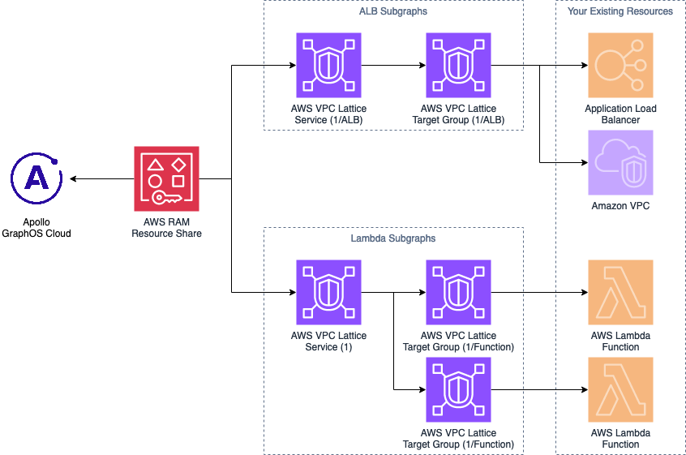

# Apollo GraphOS Cloud Private Subgraphs Module

This Terraform module helps you create the necessary resources for sharing your private subgraphs with Apollo GraphOS Cloud using [AWS VPC Lattice](https://aws.amazon.com/vpc/lattice/).

At the moment, this module supports private subgraphs as AWS Lambda functions, or behind an internal Application Load Balancer. See the [Prerequisites](#prerequisites) section below to learn how these resources must be configured.

## Resources created



### For AWS Lambda functions

This module will create:

* 1 Lattice service
* 1 Lattice listener
* 1 Lattice target group per Lambda function
* 1 Lattice listener rule per Lambda function, using path prefix mapping
* 1 Lambda permission per Lambda function, granting permission to the Lattice target group to invoke the function

### For Amazon Application Load Balancers

This module will create:

* 1 Lattice service per ALB
* 1 Lattice target group per ALB
* 1 Lattice listener, with a default rule targeting the ALB

### For all resources

This module will create:

* 1 RAM Resource Share containing all Lattice services
* 1 Invitation to associate the resource share with an AWS Account managed by Apollo GraphOS Cloud

## Usage

```hcl
module "graphos_aws" {
  source = "github.com/apollographql/terraform-graphos-aws"

  alb_subgraphs = {
    "some-subgraph" = {
      alb_arn  = "arn:aws:elasticloadbalancing:eu-west-1:123456789012:loadbalancer/app/some-app-name/1234567890abcdef" # Arn for the internal ALB
      vpc_id   = "vpc-1234567890abcdef0" # VPC the load balancer is deployed to
      alb_port = 80 # Or custom port 
    }
  }

  lambda_subgraphs = {
    "a-lambda-subgraph" = {
      lambda_function_arn = "arn:aws:lambda:eu-west-1:012346789012:function:test-function"
    }
  }

  apollo_account_ids = ["my_account_id"]
  apollo_graph_refs  = ["my-graph@my-variant"]
}
```

## Variables

* `prefix`: prefix for the names of created resources (default: `graphos`)
* `tags`: optional list of tags for resources
* `alb_subgraphs`: map of subgraph names to ALB configuration
  * `alb_arn`: ARN of the Application Load Balancer
  * `vpc_id`: ID of the VPC where the Application Load Balancer is deployed
  * `alb_port`: Port the ALB receives traffic through (defaults to 80)
* `lambda_subgraphs`: map of subgraph names to Lambda functions
  * `lambda_function_arn`: ARN of the Lambda function
* `apollo_account_ids`: List of unique identifiers to your Apollo accounts, to only allow traffic from Cloud Routers in your Apollo account only as an extra layer of security. This value is not the same as the Apollo Account ID in your Organization settings page.
* `apollo_graph_refs`: List of graph variant references, to only allow traffic from Cloud Routers matching those specific graph variant references.

## Outputs

* `resource_share_arn`: The AWS RAM resource share ARN to use in [Apollo GraphOS Studio](https://studio.apollographql.com/)
* `alb_subgraph_urls`: Base URL for the subgraphs backed by Application Load Balancers
* `lambda_subgraph_urls`: Base URL for the subgraphs backed by Lambda functions

## Prerequisites

### For AWS Lambda functions

* The Lambda function must be in the same AWS Region as the lattice services.
* You must have permission to add a Lambda permission to those Lambda functions.

### For Amazon Application Load Balancers

* The ALB must be in the same AWS Region as the lattice services.
* The ALB must be an **internal** load balancer.
* The ALB must have a listener configured to listen on `HTTP` on port `80` by default or whatever value you provide to `alb_port`.
* The security group associated with the ALB must allow TCP traffic on port `80` (or you must set `alb_port`) from the [VPC Lattice prefix list](https://docs.aws.amazon.com/vpc-lattice/latest/ug/security-groups.html).
* The `vpc_id` must be the same as the VPC where the ALB is deployed.

## Maintainers

|Name|Username|
|---|---|
|Aaron Arinder|[@aaronArinder](https://github.com/aaronArinder/)|
|Brian George|[@dotdat](https://github.com/dotdat)|
|Camille Lawrence|[@gocamille](https://github.com/gocamille)|
|Nicolas Moutschen|[@nmoutschen](https://github.com/nmoutschen/)|

## License

This terraform module is licensed under the MIT License. See the [LICENSE.md](./LICENSE.md) file.
